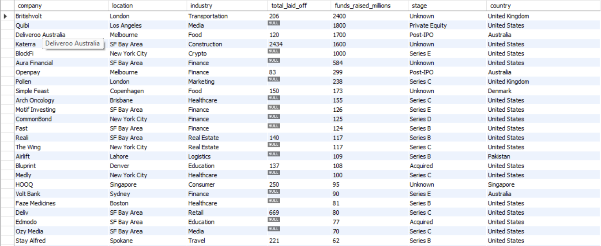

# 🌍 Global Layoffs SQL Analytics Project

A modular, sequential SQL data pipeline and exploratory data analysis (EDA) project analyzing global corporate layoffs using **MySQL**. 

This project transforms a raw, unformatted dataset into a clean, analysis-ready production environment using best practices in data engineering, data cleaning, and advanced analytical querying.

---

## 📂 Project Architecture & File Structure

The project is structured sequentially into modular files to separate data definition, ingestion, transformation, and analysis:

```text
world-layoffs-sql-analysis/
│
├── 01_schema.sql         # Database and production table structure definition
├── 02_import_staging.sql # Raw staging table setup for CSV import ingestion
├── 03_data_cleaning.sql  # Data hygiene, deduplication, formatting, and null handling
├── 04_data_analysis.sql  # Advanced analytical queries, reporting views, and business insights
├── .gitignore            # Excludes OS and temporary IDE files from version control
└── assets/               # Folder storing query output screenshots
    ├── Company_100%layoff_Output.png
    ├── Rolling_Total_Output.png
    └── Top_companies_Output.png 
```
## 🛠️ Tech Stack & Tools
- **Database Management System**: MySQL
- **IDE / Tool**: MySQL Workbench (utilizing the Table Data Import Wizard)
- **SQL Concepts Applied**:
    * Data Definition Language (DDL) & Data Manipulation Language (DML)
    * String Manipulation & Standardization (`TRIM`, `DATE_FORMAT`)
    * Data Type Casting & Handling Missing Values (`CAST`, `NULLIF`, `STR_TO_DATE`)
    * Common Table Expressions (CTEs)
    * Advanced Window Functions (`DENSE_RANK()`, Running Totals / Cumulative Sums)

## 🔄 Project Pipeline & Workflow
1. **Schema Initialization** (`01_schema.sql`): Establishes the core database and defines target production table schemas.

2. **Raw Staging** (`02_import_staging.sql`): Creates staging tables with text (`VARCHAR`) datatypes to safely catch unparsed data straight from the CSV import wizard without throwing errors.

3. **Data Cleaning & Transformation** (`03_data_cleaning.sql`):
  - Removed duplicate records.
  - Standardized and trimmed text fields (e.g., company names, industries, countries).
  - Converted raw text dates into proper SQL `DATE` objects.
  - Handled missing and null values across financial metrics.

4. **Data Analysis** (`04_data_analysis.sql`): Executed a series of complex analytical queries and established persistent reporting views to uncover macro-economic trends, industry vulnerabilities, and corporate downscaling trajectories.

## 📊 Key Business Questions & Insights Explored
The analysis phase answers 12 core business questions split into four analytical categories:

### 1. Overall Impact & Timeline
  - Identifying peak single-day workforce reduction severity and maximum percentage drops.
  - Establishing the active chronological timeline of the economic downturn.

### 2. Company & Funding Impact
  - Investigating high-funding companies that suffered 100% total organizational collapse.
  - Calculating cumulative company downsizing and year-over-year longitudinal performance.
  - Ranking top-downsizing corporations annually using window functions (`DENSE_RANK()`).

### 3. Industry, Country & Stage Analysis
  - Pinpointing which market sectors and industries suffered the most severe structural contractions.
  - Mapping geographic concentrations of labor market distress by country.
  - Evaluating corporate lifecycle vulnerability based on funding stages (e.g., Post-IPO, Series funding).

### 4. Time-Series & Progression Trends
  - Tracking macro-economic degradation via annual and monthly aggregate layoff distributions.
  - Computing running cumulative totals over time to visualize the compounding scale of the crisis.

## 📈 Example Query Output Previews
### Most Funded Companies with 100% Layoffs

### Top Downsizing Companies Ranked Annually
[Rolling_Total_Output](assets/Rolling_Total_Output.png)
### Cumulative Running Total of Layoffs
[Top_companies_Output](assets/Top_companies_Output.png)

## 🚀 How to Run This Project
1. Clone or download this repository locally.
2. Open MySQL Workbench and execute the scripts sequentially:
    - Run `01_schema.sql` to set up the database and schema.
    - Run `02_import_staging.sql`, then use the MySQL Workbench Table Data Import Wizard on the `layoff_staging2` table to load your raw CSV data.
    - Run `03_data_cleaning.sql` to clean, transform, and migrate the data into production.
    - Run `04_data_analysis.sql` to generate the reporting views and run analytical queries.

## 👤 Author
###   ROSHAN KUMAR
###   (Aspiring Data Analyst)
